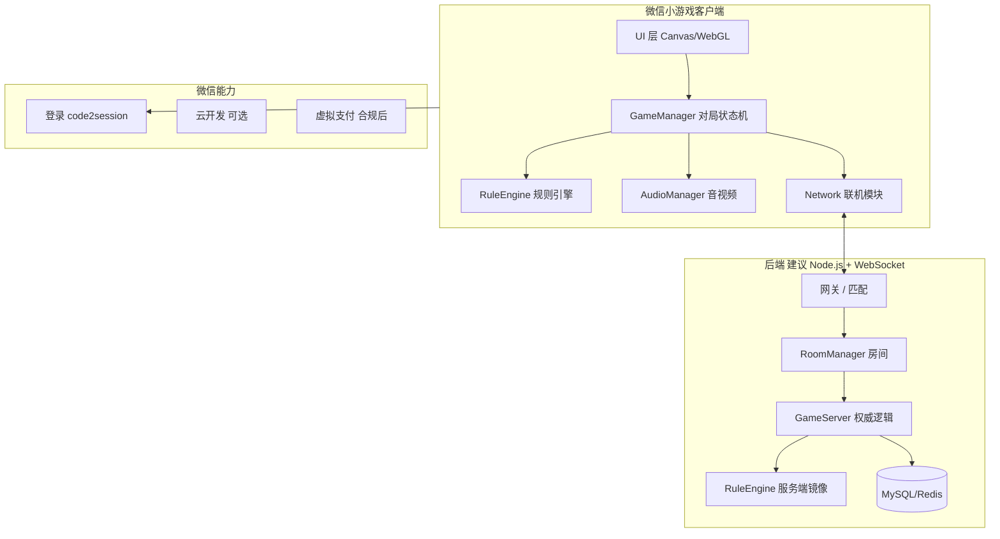

# 广东麻将微信小游戏 — 产品与技术方案说明

> 项目路径：`majarCnMd`（当前为微信小游戏 QuickStart 模板，需整体替换为麻将架构）  
> 对标参考：腾讯麻将（欢乐麻将）的体验层级，规则聚焦：**广东推倒胡 / 广州麻将** 主流玩法  
> 文档版本：v1.0 | 更新日期：2026-05-25

---

## 一、项目定位与目标

### 1.1 产品定位

| 维度 | 说明 |
|------|------|
| 平台 | 微信小游戏（`compileType: game`），竖屏为主，兼顾平板横屏可选 |
| 核心玩法 | 广东麻将（推倒胡），4 人局，支持人机 / 好友房 / 快速匹配 |
| 体验对标 | 腾讯麻将：流畅出牌、清晰番型展示、房间体系、段位、任务、装扮 |
| 差异化 | 方言语音包（粤语为主）、广东地方番型与买马规则可配置、轻量包体 |

### 1.2 成功标准（可验收）

- **规则正确**：胡牌判定、番型结算、杠分、流局、买马与广东常见附加规则可配置且与线下约定一致（需规则表 + 用例回归）。
- **对局完整**：发牌 → 行牌 → 胡/流局 → 结算 → 战绩，单局 &lt; 3 分钟（快节奏房）。
- **视听达标**：BGM/环境音/操作音效分层；可选真人方言语音（出牌、碰杠胡、番型播报）。
- **联机稳定**：好友房延迟可接受（目标：同城 &lt; 150ms 感知）；断线重连 30s 内恢复。
- **合规上线**：版号/类目、用户协议、防沉迷、实名（按上线地区要求）。

---

## 二、广东麻将规则范围（建议首版锁定）

首版建议锁定 **「推倒胡 + 可配置番型表」**，避免首版支持全部广东变体导致无法测试。

### 2.1 牌具与人数

- **人数**：4 人
- **牌数**：万、筒、条各 1–9 × 4，字牌（东南西北中发白）各 4，共 **136 张**（首版不做花牌；二期可加梅兰竹菊春夏秋冬）
- **庄家**：首局随机或房主；连庄规则可配置（胡牌者坐庄 / 流局连庄等）

### 2.2 基础行牌（推倒胡常见）

| 操作 | 首版 | 说明 |
|------|------|------|
| 摸牌 / 打牌 | ✅ | 仅自己回合可摸打 |
| 吃 | ❌ 或 可配置关 | 广东推倒胡多数不吃 |
| 碰 | ✅ | |
| 明杠 / 补杠 / 暗杠 | ✅ | 杠分即时或胡牌结算，需规则开关 |
| 胡 | ✅ | 点炮 / 自摸；一炮多响可配置 |
| 过 | ✅ | 放弃碰杠胡 |

### 2.3 胡牌与番型（示例番表，数值可配置）

建议实现 **「番型引擎」**：每条番型为 `{ id, name, fan, mutex[], require[] }`，结算时遍历组合取最大或累加（由规则包决定）。

**常见番型（首版建议 ≥ 15 种）**：

| 番型 | 参考番数 | 备注 |
|------|----------|------|
| 平胡 | 1 | 基础胡 |
| 对对胡 | 2–3 | |
| 混一色 | 3–4 | |
| 清一色 | 6–7 | |
| 七对 | 4–6 | 广东部分玩法允许 |
| 豪华七对 | 更高 | |
| 小三元 / 大三元 | 中发白刻子 | |
| 小四喜 / 大四喜 | 风刻 | |
| 十三幺 | 高番 | 可选开关 |
| 杠上开花 / 抢杠胡 | 加番 | |
| 海底捞月 / 河底捞鱼 | 加番 | |
| 无鬼 / 四鬼 | 与鬼牌规则联动 | |
| 门清 / 自摸 | 加番 | |

**鬼牌（百搭）**：首版建议支持 0/1/2 张翻鬼，鬼可替任意牌；**无鬼加番** 单独配置。

### 2.4 买马（广东特色，建议二期完整、首版可简化）

- 胡牌后根据骰子或剩余牌翻开「马牌」，中马者再计分。
- 首版可只做：**固定买 2/4/6 马 + 中马倍数**，完整动画二期补。

### 2.5 计分方式

- **底分 × 番数 × 倍率**（房间倍率、段位加成）
- **杠分**：明杠/暗杠/补杠分别计分，是否「杠爆」单独配置
- **封顶**：如 32/64 番封顶，防一局破产式体验（休闲场）

### 2.6 规则配置包（JSON）

```json
{
  "ruleId": "gd_tuidaohu_v1",
  "name": "广东推倒胡",
  "tiles": 136,
  "allowChi": false,
  "ghostCount": 1,
  "fanTable": "config/fan_gd_v1.json",
  "horse": { "enabled": true, "count": 4 },
  "maxFan": 64,
  "drawTimeoutSec": 15
}
```

所有联机对局以 **房主选择的 ruleId** 为准，服务端校验，防篡改。

---

## 三、对标腾讯麻将 — 功能清单（分期）

### 3.1 P0 — 能玩、能上线试玩

- 大厅：快速开始、创建房间、加入房间（房间号）
- 对局：完整 4 人流程（可先 1 真人 + 3 AI）
- 广东推倒胡规则包 v1
- 2D 牌桌 UI、手牌/出牌区、碰杠区
- 基础音效 + 1 首 BGM
- 结算页：番型、得分、简单战绩
- 微信登录、用户昵称头像
- 设置：音乐/音效/语音开关

### 3.2 P1 — 接近「腾讯麻将」休闲体验

- 匹配场（分场：新手/进阶，底分不同）
- 段位与赛季
- 番型教程、胡牌提示（可关闭）
- 回放（牌局序列 JSON 重演）
- 好友房：微信分享进房、房主踢人、准备状态
- 装扮：牌桌/牌背（不影响数值）
- 任务 / 签到 / 金币场（经济系统）
- **方言语音包**：粤语出牌播报（见 §7）

### 3.3 P2 — 商业化与运营

- 商城（装扮、道具如「看牌器」仅娱乐场，禁止赌博导向）
- 活动、排行榜（开放数据域好友榜）
- 直播观战（可选）
- 更多广东变体：江门、梅州等地方规则包
- 买马完整动画与统计
- 客服、举报、敏感词

---

## 四、技术架构

### 4.1 总体架构图



### 4.2 客户端技术选型

| 模块 | 选型 | 说明 |
|------|------|------|
| 渲染 | **Canvas 2D**（首版）→ WebGL（二期 3D 牌） | 小游戏主包体积敏感 |
| 语言 | ES6+，模块化 `import` | 与现有模板一致 |
| 状态 | 集中 `GameState` + 事件总线（可保留 tinyemitter） | 禁止散落全局变量 |
| 联机 | **WebSocket** + Protobuf 或 JSON | 帧同步改为 **状态同步**（麻将回合制更适合） |
| 配置 | JSON 规则包 + 热更新子包 | `game.json` 配置分包 |
| 构建 | 微信开发者工具 + 可选 webpack 分包 | 主包 &lt; 4MB |

### 4.3 服务端（权威服务器）

麻将必须 **服务端权威**：

- 洗牌、发牌、摸牌顺序仅服务端知道完整牌墙
- 客户端只收到：**自己手牌** + **公共区** + **各玩家手牌数量**
- 所有碰杠胡请求由服务端校验后广播
- 防作弊：出牌时间戳、操作序列校验、异常封号

推荐栈：

- **Node.js** + `ws` / Socket.io（或 Go 单房间 goroutine）
- **Redis**：房间、在线状态、匹配队列
- **MySQL**：用户、战绩、经济
- 部署：腾讯云 / 微信云托管

### 4.4 同步模型（回合制）

```
Client: 玩家点击「碰」
  → C2S: { action: "peng", tile: "3w", seq: 12 }
Server: 校验是否可碰 → 更新状态 → 广播
  → S2C: { event: "action", player: 2, type: "peng", ... }
All Clients: 播放动画 → 更新本地只读状态机
```

**断线重连**：进房时下发完整 `snapshot` + 最近 N 步 `actionLog`。

---

## 五、客户端模块划分（目录规划）

在现有 `js/` 基础上重构为：

```
majarCnMd/
├── game.js / game.json
├── audio/
│   ├── bgm/                 # 大厅、对局、胜利
│   ├── sfx/                 # 摸牌、出牌、碰杠胡、按钮
│   └── voice/               # 方言语音（分包）
│       ├── cantonese/
│       └── mandarin/
├── images/
│   ├── tiles/               # 牌面 34×N 状态
│   ├── table/               # 桌布、指针、风位
│   └── ui/
├── config/
│   ├── rules/               # 广东规则包
│   └── fan/                 # 番型表
├── js/
│   ├── main.js              # 入口、场景路由
│   ├── databus.js           # 全局会话数据
│   ├── network/             # WebSocket、协议编解码
│   ├── scenes/
│   │   ├── lobby.js         # 大厅
│   │   ├── room.js          # 房间等待
│   │   └── table.js         # 牌桌
│   ├── game/
│   │   ├── GameManager.js   # 对局状态机
│   │   ├── Player.js
│   │   ├── Wall.js          # 牌墙
│   │   └── ActionValidator.js
│   ├── rules/
│   │   ├── RuleEngine.js    # 规则入口
│   │   ├── WinDetector.js   # 胡牌判定
│   │   ├── FanCalculator.js # 番型计算
│   │   └── gd/              # 广东实现
│   ├── render/
│   │   ├── TableRenderer.js
│   │   ├── TileSprite.js
│   │   └── Animation.js
│   ├── runtime/
│   │   ├── AudioManager.js  # 扩展原 music.js
│   │   └── VoiceManager.js  # 方言语音
│   ├── ai/
│   │   └── MahjongAI.js     # 人机
│   └── libs/
└── server/                  # 可选 monorepo 服务端
```

---

## 六、核心系统详细设计

### 6.1 对局状态机

```
Idle → Dealing → TurnPlay → WaitReaction → (Peng/Gang/Win chain) → NextTurn
  → WinSettle | DrawSettle → RoundEnd → (下一局) | RoomEnd
```

- **TurnPlay**：当前玩家摸牌（若牌墙空则流局）→ 打牌 → 进入 **WaitReaction**（其他三家按优先级：胡 &gt; 杠 &gt; 碰）
- **WaitReaction** 超时自动「过」
- 抢杠胡、杠上开花在状态机分支中显式处理

### 6.2 胡牌判定（WinDetector）

- 标准型：递归 / 查表法判断 4 面子 + 1 将
- 特殊型：七对、十三幺独立判断
- 听牌：可选预计算（娱乐场提示）

### 6.3 番型计算（FanCalculator）

- 输入：最终手牌、副露、胡牌方式、规则包
- 输出：`[{ fanId, name, fan }]` 及总番
- 互斥关系：如清一色与混一色互斥，取高番

### 6.4 人机 AI（P0 必备）

- **启发式**：向听数最小、保留对子/顺子潜力、危险牌打出（对手露牌推断）
- **难度**：简单随机合法出牌 / 中等启发式 / 困难带防守
- 用于：单机练习、匹配不足时补位

### 6.5 UI/交互精细化

| 区域 | 要点 |
|------|------|
| 自家手牌 | 滑动理牌、点击出牌、双击确认（可配置） |
| 出牌区 | 最近 6–8 张可见，出牌飞向中央动画 |
| 副露 | 碰杠组横向排列，明杠标示供牌方 |
| 指示 | 风位、连庄、剩余牌数、当前玩家高亮 |
| 操作栏 | 胡/碰/杠/过 仅在有合法操作时弹出 |
| 番型 | 胡牌后逐条展示番型动画（对标腾讯） |
| 设置 | 牌面大小、左手模式、速度档位 |

### 6.6 网络协议（示例字段）

```typescript
// 房间
CreateRoom { ruleId, baseScore, isPrivate }
JoinRoom { roomId, password? }

// 对局
GameStart { players, dealer, ruleSnapshot }
Deal { handTiles: string[] }  // 仅发给自己 13/14 张
Draw { player, tile? }        // 他人只见摸牌动作不见牌面
Discard { player, tile }
ActionRequest { type, tile, fromPlayer? }
ActionResult { ok, reason?, newState }
Settle { scores, fanDetails, horse? }
```

牌面编码建议：`1w 2w ... 9w, 1t, 1b, dong, nan, xi, bei, zhong, fa, bai`。

---

## 七、音频与方言语音系统

### 7.1 音频分层（扩展现有 `Music` 为 `AudioManager`）

| 层级 | 内容 | 实现 |
|------|------|------|
| BGM | 大厅、对局、结算 | `InnerAudioContext`，循环，淡入淡出 |
| 环境音 | 洗牌、骰子 | 短音效 |
| SFX | 摸牌、出牌、碰、杠、胡、按钮 | 预加载池，防重叠播放限流 |
| Voice | 方言人声 | 独立子包，按事件播放 |

### 7.2 语音事件表（建议 ≥ 40 条粤语）

- 数字牌：`一万` … `九万`，筒、条同理
- 字牌：`东风` `红中` `发财` 等
- 操作：`碰` `杠` `胡了` `自摸` `点炮`
- 番型：`清一色` `对对胡` `鸡胡` …
- 系统：`请出牌` `时间不多啦`

**播放策略**：

- 出牌：优先播 `{tileName}.mp3`，无则播通用 `discard.mp3`
- 碰杠胡：操作音 + 语音可并行（语音略延迟 100ms）
- 设置：语音开/关、粤语/普通话、音量独立滑块

### 7.3 资源与包体

- 主包：BGM 1 首 + 核心 SFX（&lt; 500KB 压缩后）
- **分包 `voice-cantonese`**：语音资源，进入对局前 `wx.loadSubpackage`
- 格式：mp3 64–96kbps，单条 &lt; 30KB

### 7.4 录制与版权

- 自制配音或购买商用语音包；避免未授权影视片段
- 腾讯麻将语音为商业资产，**不可直接拷贝**，仅参考节奏与覆盖范围

---

## 八、微信生态与合规

### 8.1 必备能力

| 能力 | API/说明 |
|------|----------|
| 登录 | `wx.login` + 服务端 `code2session` |
| 分享进房 | `wx.shareAppMessage` 带 `roomId` query |
| 订阅消息 | 好友房开局提醒（需用户授权） |
| 存储 | `wx.setStorage` 本地设置；敏感数据仅服务端 |
| 开放数据域 | 好友排行榜（需单独 context） |
| 性能 | `wx.getPerformance().now()` 监控帧率 |

### 8.2 合规要点

- 类目：**棋牌 → 麻将**，需相应资质与版号（中国大陆上线）
- **不得**涉及真实货币赌博；金币场仅为虚拟积分
- 防沉迷：未成年人时长与消费限制（按平台最新政策）
- 用户协议、隐私政策、注销账号流程
- UGC（语音聊天若做）需审核或仅限好友房且举报机制

### 8.3 性能指标

- 首屏可交互 &lt; 3s（WiFi）
- 对局帧率 ≥ 30 FPS（2D Canvas）
- 单局内存峰值 &lt; 150MB（中端机）

---

## 九、数据与运营

### 9.1 核心数据表（服务端）

- `user`：openid、昵称、头像、段位、金币
- `room`：房间号、规则、状态、玩家列表
- `game_record`：牌局 ID、规则、动作 log、结算 JSON
- `user_stats`：总局数、胜率、最大番

### 9.2 埋点（数据分析）

- 漏斗：启动 → 登录 → 进房 → 开局 → 完局
- 对局：时长、流局率、胡牌方式分布、番型分布
- 留存：次日/7 日留存

---

## 十、开发阶段与人力估算

### 10.1 里程碑（约 4–6 个月，5–7 人小团队）

| 阶段 | 周期 | 交付物 |
|------|------|--------|
| M0 预研 | 2 周 | 规则文档定稿、协议草案、UI 原型 |
| M1 单机核心 | 4 周 | 规则引擎、胡牌、单机 4 人 AI、基础牌桌 |
| M2 联机 | 4 周 | 服务端房间、状态同步、好友房 |
| M3 体验 | 3 周 | 音效语音、动画、结算、设置 |
| M4 运营 | 3 周 | 段位、任务、商城框架、分享 |
| M5 测试上线 | 2 周 | 压测、合规材料、提审 |

### 10.2 角色分工

| 角色 | 人数 | 职责 |
|------|------|------|
| 客户端 | 2 | Canvas、状态机、联机、UI |
| 服务端 | 1–2 | 权威逻辑、匹配、数据 |
| 策划 | 1 | 规则表、番型、经济 |
| 美术 | 1 | 牌面、牌桌、动效资源 |
| 音频 | 外包/0.5 | BGM、音效、粤语配音 |
| 测试 | 1 | 牌型用例、联机压测 |

### 10.3 风险

| 风险 | 缓解 |
|------|------|
| 规则争议 | 固定 ruleId，局内展示规则摘要 |
| 包体超限 | 分包 + 资源压缩 + 远程 CDN（需合规域名） |
| 联机作弊 | 服务端权威 + 行为审计 |
| 版号周期 | 先做无付费试玩版；商业化后置 |

---

## 十一、测试策略

### 11.1 规则单元测试（必须）

- 牌型分解：标准胡、七对、十三幺边界
- 番型：每种番型至少 2 个正负用例
- 杠分、流局、一炮多响、抢杠胡

### 11.2 联机测试

- 4 客户端同步一致性（同一 actionLog 重演结果一致）
- 断网 5s / 30s / 60s 重连
- 弱网延迟 500ms 模拟

### 11.3 兼容

- iOS / Android 微信主流版本
- 全面屏安全区适配

---

## 十二、从当前仓库落地的第一步

当前 `majarCnMd` 为 **飞机大战示例**，建议按以下顺序改造：

1. **保留**：`game.js` 入口模式、`tinyemitter`、`sprite` 基类思路、`music.js` 扩展为 `AudioManager`
2. **删除/替换**：`player/`、`npc/` 射击逻辑
3. **新增**：`js/rules/` + `js/game/GameManager.js` + `scenes/table.js`
4. **配置**：`project.config.json` 中 `projectname` 改为 `gdMahjong`，`game.json` 增加 `subpackages` 语音分包
5. **并行**：搭建 `server/` 最小房间服务（可先本地 Node 调试）

---

## 十三、附录

### A. 与腾讯麻将的功能对照简表

| 功能 | 腾讯麻将 | 本方案首版 | 二期 |
|------|----------|------------|------|
| 地方规则 | 多省份 | 广东推倒胡 | 多地规则包 |
| 3D 牌桌 | 有 | 2D | WebGL |
| 方言语音 | 有 | 粤语包 | 更多方言 |
| 排位 | 有 | 简易段位 | 赛季 |
| 回放 | 有 | - | 有 |
| 社交 | 强 | 分享进房 | 公会等 |

### B. 参考文档

- [微信小游戏开发文档](https://developers.weixin.qq.com/minigame/dev/guide/)
- [小游戏音频 InnerAudioContext](https://developers.weixin.qq.com/minigame/dev/api/media/audio/InnerAudioContext.html)
- [小游戏分包加载](https://developers.weixin.qq.com/minigame/dev/guide/base-ability/subPackage/useSubPackage.html)

---

**说明**：本文档为产品与架构方案；完整实现需按 §10 分期迭代。若需要，可从 **M1 规则引擎 + 单机牌桌** 开始在当前仓库编码落地。
